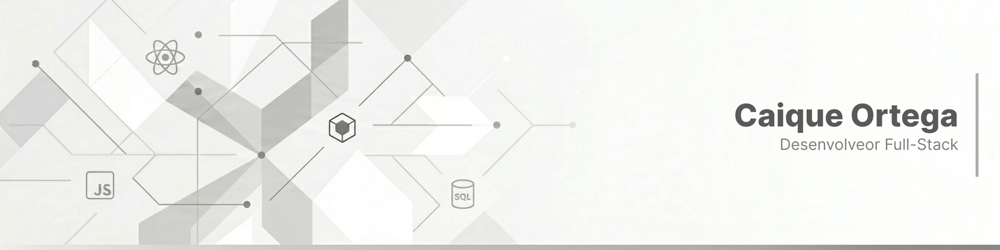

<header>
  <div>
    
  </div>
</header>

<br />
  
  ## 💻 Sobre Mim
  
```js
import Desenvolvedor from "@caique-ortega/developer";

export default class SobreMim extends Desenvolvedor {
    constructor() {
        super({
            nome: "Caique Ortega",
            area: "Desenvolvedor",
            especialidade: "Full-Stack",
            localizacao: "Cianorte - PR",
            habilidadesTecnicas: {
                frontendWeb: ["Next.js", "React", "Tailwind CSS"],
                frontendMobile: ["React Native", "Expo"],
                backend: ["Node.js", "Express", "NestJS", "Prisma", "PostgreSQL"],
                tools: ["Git", "Docker", "TypeScript", "Linux"]
            }
        });
    }

    descrever() {
        return (
            `Olá! Meu nome é ${this.nome} e atuo como ${this.area} ${this.especialidade}, em ${this.localizacao}.\n` +
            `Tenho foco no desenvolvimento de aplicações completas, unindo frontend, mobile e backend.\n\n` +

            `No frontend web, trabalho com ${this.habilidadesTecnicas.frontendWeb.join(", ")}.\n` +
            `No mobile, utilizo ${this.habilidadesTecnicas.frontendMobile.join(", ").replace(/,([^,]*)$/, " e$1")}.\n\n` +

            `No backend, construo APIs com ${this.habilidadesTecnicas.backend.join(", ")}.\n` +
            `Também utilizo ferramentas como ${this.habilidadesTecnicas.tools.join(", ").replace(/,([^,]*)$/, " e$1")} no meu fluxo de desenvolvimento.\n\n` +

            `Sempre evoluir no processo e transformando, entre um commit e outro, café em código e bugs em aprendizado...`
        );
    }
}
```


<div align="center">
  
## 🚀 Stack Tecnológicas

<p>
  
  
  
  
  
  
  
  
  
</p>
</div>
<div align="center">
  <picture>
    <source media="(prefers-color-scheme: dark)" 
      srcset="https://raw.githubusercontent.com/CaiqueOrtega/CaiqueOrtega/output/github-contribution-grid-snake-dark.svg">
    
  </picture>
</div>

---

<div align="center">
  
</div>
